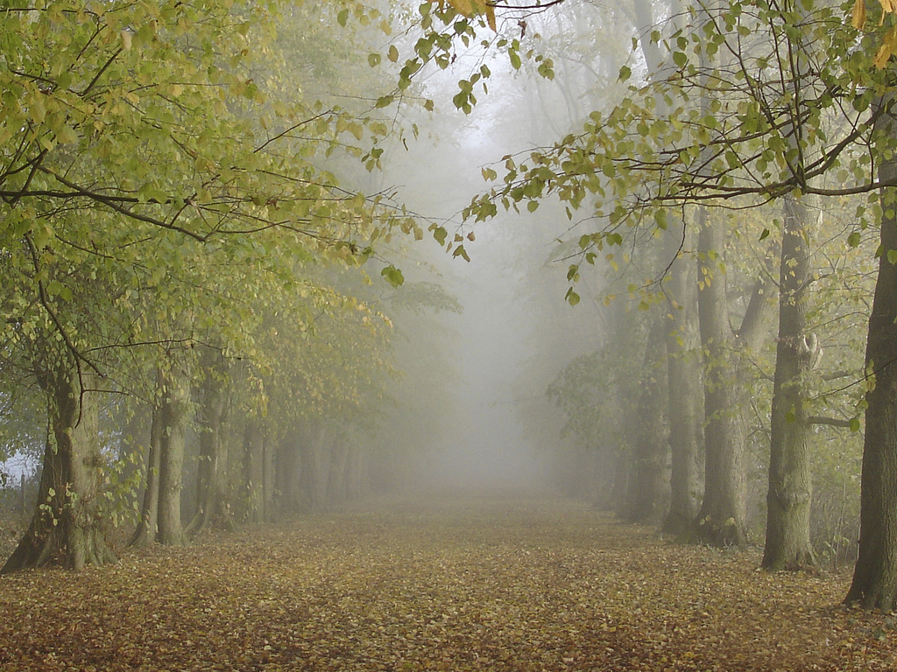
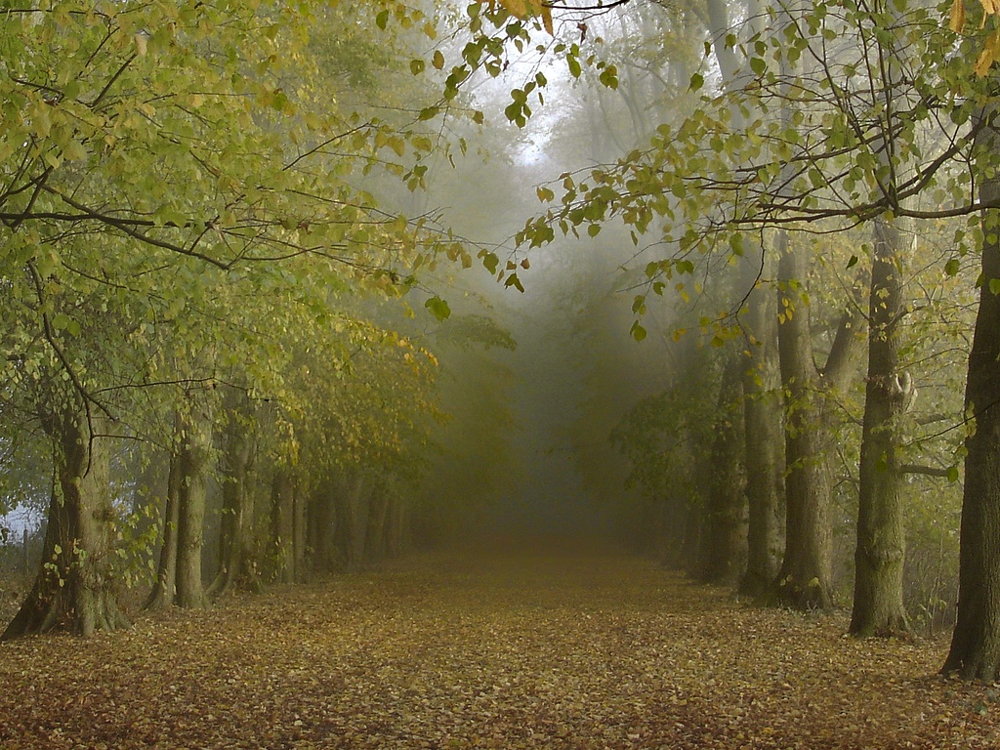
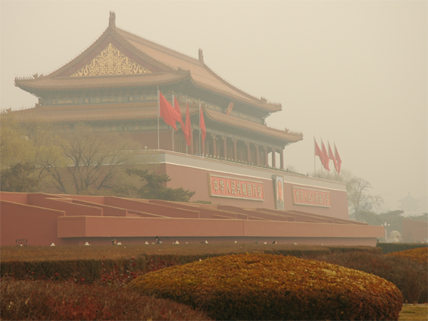
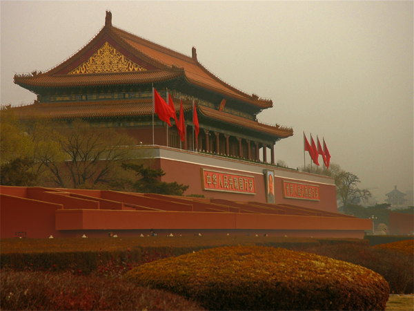
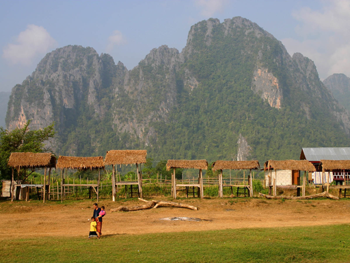
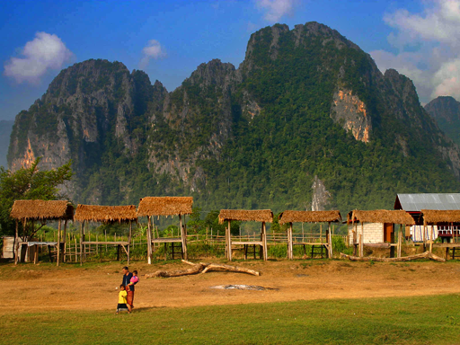

# Single Image Dehazing Based on Dark Channel Prior

## Introduction

This project implements a classic single\-image dehazing algorithm based on the **Dark Channel Prior \(DCP\)** theory\. To optimize the image restoration effect and eliminate halo artifacts generated by traditional dark channel algorithms, the project introduces **Guided Image Filtering** for soft refinement of the transmission map\.

The algorithm effectively removes atmospheric haze, restores the true color and texture details of blurred hazy images, and features simple deployment, fast operation and outstanding restoration performance, which is suitable for basic research and engineering application of image defogging\.

## Dependencies

This project is developed based on Python, and the required third\-party libraries are as follows:

- **OpenCV**: Used for image reading, preprocessing, pixel operation and result output

- **NumPy**: Used for matrix operation, numerical calculation and algorithm logic implementation

You can install all dependencies quickly via the following command:

```Plain Text
pip install opencv-python numpy
```

## Algorithm Principle \& Reference

The core algorithm of this project comes from two classic top conferences in computer vision, and the theoretical system is mature and reliable:

- **Dark Channel Prior**
Kaiming He, Jian Sun, Xiaoou Tang\. Single Image Haze Removal Using Dark Channel Prior\.**CVPR 2009**\.
This paper proposes the dark channel prior rule for hazy images, which is the core theoretical basis for single\-image defogging\.

- **Guided Image Filtering**
Kaiming He, Jian Sun, Xiaoou Tang\. Guided Image Filtering\. **ECCV 2010**\.
The guided filtering algorithm is used to optimize the rough transmission map obtained by DCP, smooth the image while retaining edge details, and suppress defogging artifacts\.

## Effect Demonstration

The following shows the comparison effect of the original hazy image and the dehazed image processed by the algorithm:

Comparison between hazy input images (`input/`) and dehazed output images (`output/`):

<center>




<br><br>




<br><br>




</center>

<p align="center"><em>Left: Hazy Input Image | Right: Dehazed Result Image</em></p>

*Left: Original hazy image \| Right: Image after dehazing processing*

## Core Features

- Realize end\-to\-end single image defogging without relying on additional auxiliary images

- Optimize transmission map with guided filtering to avoid edge blurring and halo artifacts

- Preserve image texture details and natural color restoration while removing haze

- Lightweight code, low operation threshold and easy secondary development and migration